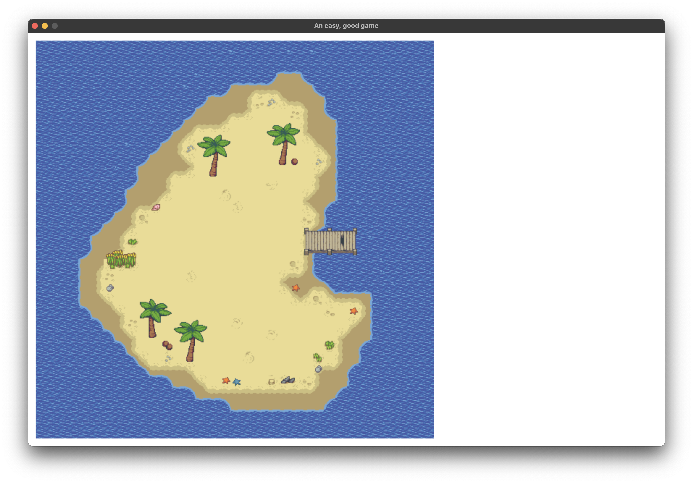
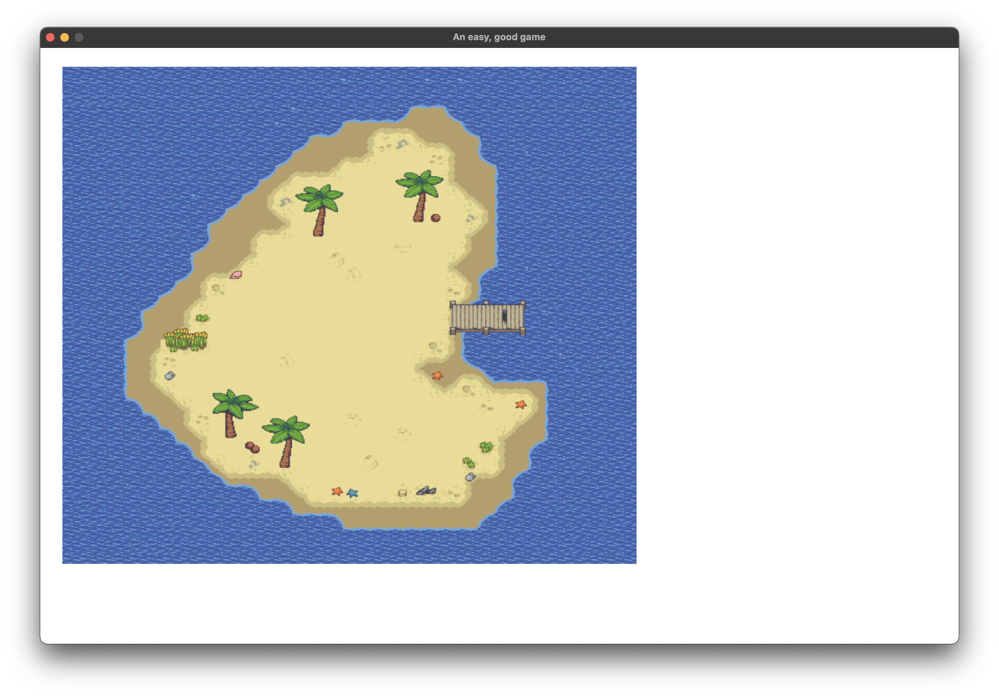

# Problem

When I set set_screen_coordinates to the same resolution as my window, I go from:

to:

# How to reproduce

- Have a mac it seems (does not reproduce on my Windows box)
- Sync repository
- Set cargo.toml to a local copy of ggez to a recent devel branch 41d9abe
- cargo run
- Hit F1 to flip between the two modes
